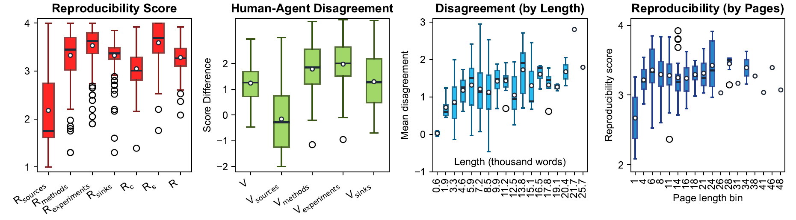
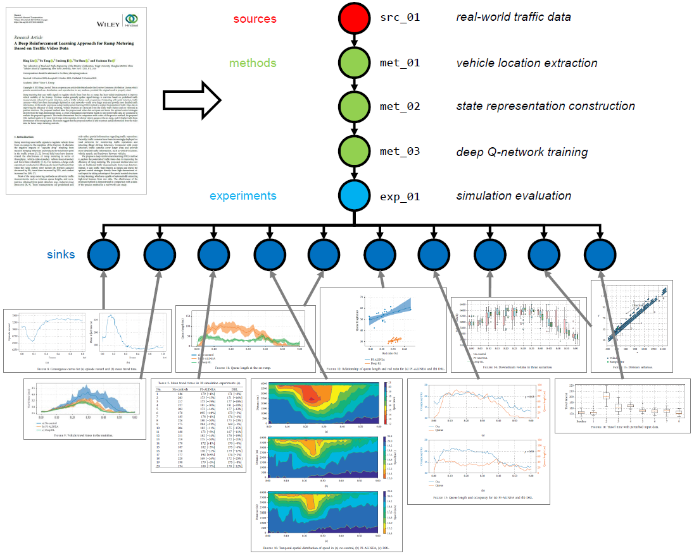

> Based on the Machine Learning paper code template from
> [Papers with Code](https://github.com/paperswithcode/releasing-research-code/blob/master/templates/README.md).

# 🦜 ARA: Agentic Reproducibility Assessment For Scalable Support Of Scientific Peer-Review

## Table of Contents
- [Introduction](#introduction)
- [Repository Structure](#repository-structure)
- [Data](#data)
- [Requirements](#requirements)
  - [LLM API Keys](#llm-api-keys)
  - [Python Setup Option 1: pip and requirements.txt](#python-setup-option-1-pip-and-requirementstxt)
  - [Python Setup Option 2: uv](#python-setup-option-2-uv)
- [Running ARA](#running-ara)
  - [Prepare PDF Data](#prepare-pdf-data)
  - [Run One Dataset](#run-one-dataset)
  - [Run Consistency Experiments](#run-consistency-experiments)
  - [Generate Tables & Figures](#generate-tables--figures)
- [Results](#results)
  - [Consistency of Workflow Reconstruction and Scoring](#consistency-of-workflow-reconstruction-and-scoring)
  - [Cross-Dataset Benchmarking](#cross-dataset-benchmarking)
  - [Stage-Wise ReScience C Assessment](#stage-wise-rescience-c-assessment)
  - [Human-Agent Disagreement](#human-agent-disagreement)
- [Default JSON Structure](#default-json-structure)
- [Prompt Templates](#prompt-templates)
- [License](#license)

## Introduction

Scientific peer review increasingly struggles to assess reproducibility at the scale and complexity of modern research output.
Evaluating reproducibility requires reconstructing experimental dependencies, methodological choices, data flows, and result-generating procedures, which often exceeds what human reviewers can provide.

Agentic Reproducibility Assessment (ARA) formalizes reproducibility assessment as a structured reasoning task over scientific documents.
Given a paper, ARA extracts a directed workflow graph linking sources, methods, experiments, and outputs, then evaluates its reconstructability using structural and content-based scores for reproducibility assessments.

Experiments on 213 ReScience C articles - the largest cross-domain benchmark of human-validated computational reproducibility studies considered to date - demonstrate ARA's generalizability and consistent workflow reconstruction and assessment across LLMs, model temperatures, and scientific domains.
These results highlight ARA's potential to complement human review at scale and support next-generation peer review.

<table>
<tr>
<td>

</td>
</tr>
<tr>
<td>
<b>Agentic Reproducibility Assessment Pipeline (<i>ARA</i>).</b><br>
First, a scientific paper or document <i>D</i> is transformed into a directed workflow graph <i>G</i> with sources, methods, experiments, and sinks. Second, the workflow graph's reconstructability is assessed through node-level scoring. Third, node-level assessments are aggregated into stage-level and overall reproducibility scores.
</td>
</tr>
</table>

## Repository Structure

```text
./agentic_reproducibility_assessment/
├── data/
|   ├── experiments/
|   |   ├── batch_runs/
|   |   └── consistency_checks/
|   ├── reprobench/
|   ├── reproscreener/
|   └── resciencec/
├── figures/
|   └── github_readme/
└── src/
    ├── _analysis/
    ├── _batch_runs/
    ├── _experiments/
    ├── _preparation/
    └── ara_pipeline/
```

The repository contains benchmark data, PDF archives, generated ARA JSON profiles, summary CSVs, and the source code used to run and analyze the pipeline.

The main dataset folders are under `data/`. ReScience C is in `data/resciencec/`, Repro-Bench is in `data/reprobench/`, and Reproscreener is in `data/reproscreener/`. The checked-in generated ARA profiles are stored as zip archives: `data/experiments/batch_runs/*.zip` for single-pass benchmark runs and `data/experiments/consistency_checks/rescience_c.zip` for repeated consistency experiments. 

The core ARA implementation is in `src/ara_pipeline/`. Use `src/_batch_runs/run_dataset.py` for full-dataset single-pass runs, `src/_experiments/consistency_check.py` and `src/_experiments/consistency_check_offline_models.py` for repeated consistency runs, and `src/_analysis/` for scripts and notebooks that generate paper tables and figures.

## Data

The paper uses three reproducibility-assessment resources that differ in domain, scale, and annotation scheme.

| Criterion | Reproscreener | Repro-Bench | ReScience C |
|-----------|---------------|-------------|-------------|
| Size | 50 papers | 112 papers | 213 papers |
| Time span | 2021-2022 | 2019-2024 | 2015-2026 |
| Domain | Machine Learning | Social Sciences | Multi-Domain |
| Reproducibility scale | Binary 0/1 | Ordinal 1-4 | Ordinal 1-4 |
| Dimensions | Gunderson-style metrics: objective, method, dataset, hypothesis, prediction, code, setup | Total reproducibility score | Sources, methods, experiments, sinks, aggregate and composite scores |
| Source | arXiv preprints from `cs.LG` and `stat.ML` | Mass reproduction study, I4R discussion papers, Retraction Watch database, X/Twitter | ReScience C open-access replication journal |

Important files:

| Group | Path | Description |
|-------|------|-------------|
| ReScience C | `data/resciencec/reproducibility_scores.csv` | Human reproducibility labels for ReScience C paper pairs |
| ReScience C | `data/resciencec/paper_summary.csv` | ReScience C paper metadata used in the paper |
| ReScience C | `data/resciencec/resciencec_papers_original.zip` | Original papers |
| ReScience C | `data/resciencec/resciencec_papers_humanreplication.zip` | Human replication reports |
| Repro-Bench | `data/reprobench/reproducibility_scores.csv` | Repro-Bench labels |
| Repro-Bench | `data/reprobench/reprobench_papers_original.zip` | Original papers |
| Repro-Bench | `data/reprobench/reprobench_papers_humanreplication.zip` | Human reproduction reports |
| Reproscreener | `data/reproscreener/reproducibility_scores.csv` | Reproscreener labels |
| Reproscreener | `data/reproscreener/reproscreener_papers_original.zip` | Original papers |
| Experiments | `data/experiments/batch_runs/*_result.csv` | Aggregated ARA scores for benchmark runs |
| Experiments | `data/experiments/batch_runs/*.zip` | Generated `PaperProfile` JSON files for benchmark runs |
| Experiments | `data/experiments/consistency_checks/rescience_c.zip` | Repeated ARA profiles for consistency analysis |

ARA models a paper as a workflow graph with four stages:

| Stage | What is assessed |
|-------|------------------|
| Sources | Datasets, assumptions, and research questions needed to initialize the workflow |
| Methods | Algorithms, transformations, variables, parameters, tools, software, hardware, and modeling steps |
| Experiments | Evaluation protocols, baselines, runtime conditions, experimental configurations, and controlled comparisons |
| Sinks | Figures, tables, and reported conclusions that should be traceable to workflow steps |

Node-level reconstructability uses an ordinal scale from 1 to 4:

| Score | Meaning |
|-------|---------|
| 1 | Missing information |
| 2 | Partial specification |
| 3 | Mostly specified components |
| 4 | Sufficient detail for independent reconstruction |

## Requirements

The code requires Python `>=3.11`; the checked-in project metadata pins development to Python `3.12`. You can set up the environment either with a standard `requirements.txt` workflow or with [uv](https://docs.astral.sh/uv/).

Furthermore, for online inference, the code requries API keys. Currently we support GEMINI and GPT with our repository.

### LLM API Keys
The online analyst supports Gemini and OpenAI backends. API keys are read from the process environment or from `src/ara_pipeline/.env`.

| Variable | Used by |
|----------|---------|
| `GEMINI_API_KEY` or `GOOGLE_API_KEY` | `GeminiPaperAnalyst` |
| `GPT_API_KEY` or `OPENAI_API_KEY` | `GPTPaperAnalyst` |

### Python Setup Option 1: pip and requirements.txt

This option works with the standard Python tooling available on most systems.

```bash
cd src
python -m venv .venv
```

Activate the environment:

```bash
# Windows PowerShell
.\.venv\Scripts\Activate.ps1

# macOS/Linux
source .venv/bin/activate
```

Install dependencies:

```bash
pip install -r requirements.txt
```

Then run scripts with `python`, for example:

```bash
python -c "from ara_pipeline.online_llm_pipelines import GeminiPaperAnalyst, GPTPaperAnalyst, PaperProfile; print('imports OK')"
```

### Python Setup Option 2: uv

The repository also keeps its `uv` project files for users who want a locked environment:

| File | Purpose |
|------|---------|
| `src/pyproject.toml` | Runtime dependencies and development tooling |
| `src/uv.lock` | Locked dependency resolution |
| `src/.python-version` | Pinned Python version, currently `3.12` |

Install dependencies from the lockfile:

```bash
cd src
uv sync
```

Run commands inside the environment with `uv run`:

```bash
cd src
uv run python -c "from ara_pipeline.online_llm_pipelines import GeminiPaperAnalyst, GPTPaperAnalyst, PaperProfile; print('imports OK')"
```


## Running ARA

The commands below assume dependencies have already been installed using either setup option in [Requirements](#requirements). If you used a virtual environment, activate it before running these commands.

### Prepare PDF Data

The benchmark PDF archives are checked in as zip files. If extracted PDF folders are missing, recreate them with:

```bash
cd src
python _preparation/download_pdfs.py
```

To force a fresh download/extraction:

```bash
cd src
python _preparation/download_pdfs.py --force
```

### Run One Dataset

`src/_batch_runs/run_dataset.py` applies ARA to every PDF in a folder or zip archive under a fixed model and temperature. It writes one `*.profile.json` file per paper and a `run_timings.csv` file.

```bash
cd src
python _batch_runs/run_dataset.py \
    --model gemini-3.1-pro-preview \
    --temperature 0.0 \
    --input-dir ../data/resciencec/resciencec_papers_original.zip \
    --output-dir ../data/experiments/batch_runs/rescience_c_gemini3_1_pro_T0
```

The script resumes by default. Existing JSON files are skipped, failed runs can be retried with `--retry-errors`, and all outputs can be regenerated with `--force`.

### Run Consistency Experiments

Consistency experiments repeat ARA across model, temperature, paper, and sample settings. The corresponding code is in:

```text
src/_experiments/consistency_check.py
src/_experiments/consistency_check_offline_models.py
```

The checked-in repeated-run outputs are archived in:

```text
data/experiments/consistency_checks/rescience_c.zip
```

### Generate Tables & Figures

The paper tables and figures can be regenerated by running the analysis scripts in `src/_analysis/` whose filenames start with `table_` or `figure_`:

```bash
cd src
python _analysis/table_benchmark.py
python _analysis/table_consistency_failure_rate.py
python _analysis/table_consistency_graph.py
python _analysis/table_consistency_repro_score.py
python _analysis/table_consistency_run_cost.py
python _analysis/figure_disagreement.py
python _analysis/figure_disagreement_v2.py
python _analysis/figure_repro_score_distribution.py
```

## Results

The paper evaluates whether ARA can approximate human reproducibility judgments from document-level evidence alone. The central experiments are:

- Consistency of workflow reconstruction and reproducibility scoring across LLMs, temperatures, and repeated runs.
- Cross-dataset benchmarking on ReScience C, Repro-Bench, and Reproscreener.
- Stage-wise comparison between ARA scores and human annotations on ReScience C.
- Disagreement analysis showing where document-level workflow reconstruction differs from execution-based human reproduction evidence.

The main full-corpus configuration selected in the paper is `gemini-3.1-pro-preview` at temperature `0`.

### Consistency of Workflow Reconstruction and Scoring

<details>
<summary>Show consistency tables</summary>

The consistency analysis repeats ARA across models, temperatures, papers, and samples. Lower variability indicates more stable workflow reconstruction or reproducibility scoring.

**Workflow graph consistency for different models (`T=0`)**

| LLM (n runs) | GED | E | V | Sources | Methods | Experiments | Sinks |
|--------------|----:|--:|--:|--------:|--------:|------------:|------:|
| gemini-2.5-flash (77) | 0.76 | 15.36 | 5.29 | 0.45 | 3.92 | 2.31 | 0.45 |
| gemini-2.5-pro (91) | 0.76 | 3.08 | 2.05 | 0.64 | 1.22 | 1.06 | 0.50 |
| gemini-3-flash-preview (94) | 0.48 | 2.69 | 1.10 | 0.24 | 0.52 | 0.72 | 0.48 |
| gemini-3.1-pro-preview (96) | 0.30 | 2.47 | 0.73 | 0.05 | 0.28 | 0.62 | 0.13 |
| gpt-4.1 (29) | 0.36 | 0.74 | 0.67 | 0.18 | 0.66 | 0.48 | 0.00 |
| qwen3-32b (60) | 0.18 | 2.57 | 2.60 | 0.00 | 1.09 | 1.43 | 0.53 |
| qwen3-8b (66) | 0.17 | 2.58 | 0.84 | 0.07 | 0.33 | 0.32 | 0.47 |

**Reproducibility score consistency for different models (`T=0`)**

| LLM (n runs) | All | Sources | Methods | Experiments | Sinks | R_c | R_s | R |
|--------------|----:|--------:|--------:|------------:|------:|----:|----:|--:|
| gemini-2.5-flash (77) | 0.05 | 0.04 | 0.06 | 0.08 | 0.03 | 0.03 | 0.14 | 0.06 |
| gemini-2.5-pro (91) | 0.07 | 0.03 | 0.11 | 0.13 | 0.10 | 0.06 | 0.13 | 0.08 |
| gemini-3-flash-preview (94) | 0.05 | 0.11 | 0.07 | 0.04 | 0.03 | 0.05 | 0.09 | 0.05 |
| gemini-3.1-pro-preview (96) | 0.02 | 0.01 | 0.04 | 0.03 | 0.01 | 0.02 | 0.04 | 0.03 |
| gpt-4.1 (29) | 0.06 | 0.00 | 0.08 | 0.13 | 0.01 | 0.04 | 0.04 | 0.04 |
| qwen3-32b (60) | 0.02 | 0.00 | 0.02 | 0.04 | 0.00 | 0.01 | 0.02 | 0.01 |
| qwen3-8b (66) | 0.02 | 0.03 | 0.02 | 0.05 | 0.04 | 0.02 | 0.09 | 0.05 |

**Failure rate across models and sampling temperatures**

| Model | 0 | 0.25 | 0.5 | 0.75 | 1 | 1.5 | 2 |
|-------|--:|-----:|----:|-----:|--:|----:|--:|
| gemini-2.5-flash | 23.0% | -- | 19.0% | -- | 19.0% | 41.0% | 32.0% |
| gemini-2.5-pro | 9.0% | -- | 5.0% | -- | 6.0% | 11.0% | 5.0% |
| gemini-3-flash-prev. | 6.0% | -- | 1.0% | -- | 2.0% | 5.0% | 3.0% |
| gemini-3.1-pro-prev. | 4.0% | -- | 1.0% | -- | 0.0% | 0.0% | 4.0% |
| gpt-4.1 | 3.3% | -- | 0.0% | -- | 3.3% | 0.0% | 16.7% |
| qwen3-32b | 40.0% | 40.0% | 40.0% | 40.0% | 40.0% | -- | -- |
| qwen3-8b | 5.7% | 15.7% | 11.7% | 1.7% | 3.3% | -- | -- |

</details>

### Cross-Dataset Benchmarking

<details>
<summary>Show benchmark table</summary>

ARA is compared with prior reproducibility-assessment systems where compatible labels are available.

| Dataset / Metric | ARA | ReplicatorAgent | ReproScreener |
|------------------|----:|----------------:|--------------:|
| ReScience C (213): ACC [%] | 60.98 (26.41) | -- | -- |
| ReScience C (213): F1 [%] | 12.49 (18.24) | -- | -- |
| ReScience C (213): Score Distance | 0.99 (0.81) | -- | -- |
| ReScience C (213): Abs. Score Distance | 1.05 (0.74) | -- | -- |
| ReproBench (112): ACC [%] | 60.71 (17.96) | 36.84 | -- |
| ReproBench (112): F1 [%] | 13.32 (18.66) | 22.67 | -- |
| ReproBench (112): Score Distance | 0.67 (1.32) | 0.63 | -- |
| ReproBench (112): Abs. Score Distance | 1.19 (0.88) | 0.98 | -- |
| GoldStandardDB (50): ACC [%] | 61.68 (32.94) | -- | 43.56 (20.12) |
| GoldStandardDB (50): F1 [%] | 50.07 (33.98) | -- | 36.66 (24.30) |

</details>

### Stage-Wise ReScience C Assessment

<details>
<summary>Show stage-wise table</summary>

Stage-wise scores compare ARA's document-level assessments with human reproduction evidence on ReScience C.

| Stage | ACC | F1 | Score Distance | Abs. Score Distance |
|-------|----:|---:|---------------:|--------------------:|
| Sources | 62.24 (15.11) | 20.04 (11.58) | -0.89 (1.37) | 1.32 (0.96) |
| Methods | 58.89 (21.29) | 13.99 (11.26) | 1.11 (0.91) | 1.22 (0.76) |
| Experiments | 56.37 (24.71) | 10.21 (8.91) | 1.30 (0.87) | 1.37 (0.75) |
| Sinks | 63.79 (21.83) | 16.86 (19.30) | 0.49 (1.04) | 0.92 (0.69) |
| Overall | 60.98 (26.41) | 12.49 (18.24) | 0.99 (0.81) | 1.05 (0.74) |

</details>

### Human-Agent Disagreement

<details>
<summary>Show disagreement figure</summary>

The disagreement analysis shows where document-level workflow reconstruction diverges from execution-based human evaluations. Agreement is highest for sources and sinks, and lower for methods and experiments, where implementation details are often only revealed during reproduction.

[Human-Agent Disagreement on Reproducibility Assessment](figures/github_readme/Figure_Disagreement.pdf)



</details>

## Default JSON Structure

The current ARA output is the canonical `PaperProfile` schema defined in `src/ara_pipeline/online_llm_pipelines.py`. Batch runs write files named like:

```text
<paper-stem>_T0_gemini-3_1-pro-preview.profile.json
```

**Default JSON Structure:**

```json
{
  "metadata": {
    "pdf_path": "...pdf",
    "extraction_model": "gemini-3.1-pro-preview",
    "title": "...",
    "authors": ["..."],
    "repository_links": ["..."],
    "supplementary_materials": ["..."],
    "hyperparameters": [
      {
        "name": "...",
        "value": "...",
        "context": "...",
        "source_quote": "..."
      }
    ],
    "stated_software_versions": {
      "package_or_tool": "version"
    },
    "hardware_requirements": null
  },
  "nodes_source": [
    {
      "node_id": "src_dataset",
      "node_name": "Dataset name",
      "source_quote": "...",
      "description": "...",
      "size_estimate": null,
      "license": null,
      "availability": "open",
      "url": "https://...",
      "reproducibility_score": 100,
      "reproducibility_rationale": "open URL provided"
    }
  ],
  "nodes_process": [
    {
      "node_id": "meth_01",
      "node_name": "Preprocess data",
      "source_quote": "...",
      "description": "...",
      "process_type": "method",
      "input_ids": ["src_dataset"],
      "outcomes": ["preprocessed_dataset"],
      "algorithm_clarity": 3,
      "tools_required": ["..."],
      "tools_mentioned": ["..."],
      "parameters_required": ["..."],
      "parameters_mentioned": ["..."],
      "reproducibility_score": 75,
      "reproducibility_rationale": "clarity=3, most params stated"
    }
  ],
  "nodes_sink": [
    {
      "node_id": "sink_fig1",
      "node_name": "Figure 1",
      "source_quote": "...",
      "description": "...",
      "input_ids": ["preprocessed_dataset"],
      "size_estimate": null,
      "type": "figure",
      "statement_clarity": 3,
      "statement_validity": "supported",
      "reproducibility_score": 75,
      "reproducibility_rationale": "inputs mostly reproducible"
    }
  ]
}
```



## Prompt Templates

The full prompt text is included in Appendix B of `paper.tex` and implemented in `src/ara_pipeline/online_llm_pipelines.py`. ARA issues six schema-constrained queries per paper in this order:

```text
header -> nodes_source -> nodes_sink -> nodes_process -> artefacts -> parameters
```

Shared system instruction:

```text
You are analysing a research paper for reproducibility. Answer using ONLY information explicitly stated in the attached PDF. If a fact is not stated, use null / omit it -- do NOT infer, guess, or draw on outside knowledge. Every item you extract must include a short literal quote from the paper that grounds it. Respond with valid JSON conforming to the provided schema; return nothing else.

BE TERSE. Avoid verbosity at all costs: do not restate the schema, do not add commentary, do not pad strings. Every string field is plain ASCII -- no combining diacritics, no non-BMP symbols, no long runs of repeated characters or tokens. Quotes are <=200 characters, descriptions <=400 characters, list items <=60 characters, lists <=8 items. If a field would exceed these limits, trim it; never produce filler to reach a limit. Close the JSON as soon as the required fields are populated -- truncation is a parse error.
```

Query prompts:

| Query | Prompt summary |
|-------|----------------|
| `header` | Extract the paper title and author list from the first page. |
| `nodes_source` | List every dataset, assign stable `src_*` IDs, describe availability, URL/DOI, and dataset reproducibility. |
| `nodes_sink` | List only results-bearing figures and tables, assign `sink_fig*` or `sink_tab*` IDs, and assess result clarity/support. |
| `nodes_process` | List workflow steps in execution order, assign `meth_XX` IDs, connect inputs/outcomes, and score method or experiment reconstructability. |
| `artefacts` | List code repositories, supplementary materials, external resources, and hardware requirements. |
| `parameters` | List parameters, hyperparameters, configuration values, software versions, and hardware requirements. |

For exact wording and rubric details, see the prompt constants and builders in `src/ara_pipeline/online_llm_pipelines.py`.

## License

This repository is released under the GNU General Public License v3.0. See `LICENSE` for details.
