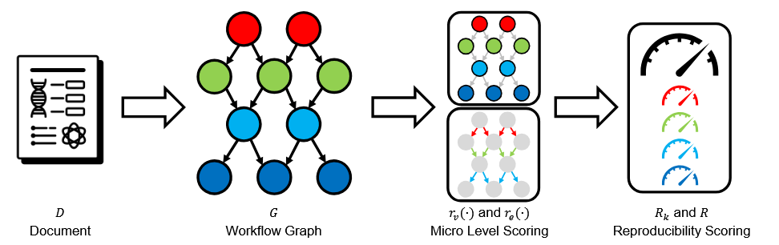

> Based on template README.md for code accompanying a Machine Learning paper from [paperswithcode](https://github.com/paperswithcode/releasing-research-code/blob/master/templates/README.md)

# 🦜 ARA: Agentic Reproducibility Assessment Via Structured Reasoning For Scalable Support Of Scientific Peer-Review

## Table of Contents
- [Introduction](#introduction)
- [Repository Structure](#repository-structure)
- [Dataset](#dataset)
- [Requirements](#requirements)
- [Training](#training)
- [Evaluation / Testing](#evaluation)
- [Pre-trained Models](#models)
- [Results](#results)
  - [ReScience C Benchmark Dataset](#results_1)
  - [Reproducibility Score Summary](#results_2)
  - [External Benchmark Datasets](#results_3)
  - [Codes to reproduce](#results_4)
- [License](#license)
- [Cluster and Runtime](#cluster)

## [Introduction](#introduction)

This repository accompanies the paper **"ARA: Agentic Reproducibility Assessment Via Structured Reasoning For Scalable Support Of Scientific Peer-Review"**.

The paper studies whether reproducibility assessment can be treated as a structured document-level reasoning task. The proposed **Agentic Reproducibility Assessment (ARA)** pipeline uses LLM agents to read scientific papers, reconstruct their methodological structure as workflow graphs, and score how well the sources, methods, experiments, and reported results can be independently reconstructed.

ARA is designed as scalable diagnostic support for peer review. It does not replace human replication attempts and it does not require executing the original experiment. Instead, it identifies reproducibility bottlenecks in the paper text by asking whether the evidence-generation workflow can be reconstructed from the publication and, when available, from human reproduction reports.

<table>
<tr>
<td>

</td>
</tr>
<tr>
<td>
<b>Agentic Reproducibility Assessment Pipeline (<i>ARA</i>).</b> <br>
First, a scientific paper or document <i>D</i> is transformed into a directed workflow graph <i>G</i> with sources, methods, experiments, and sinks.
Second, the workflow graph's reconstructability is assessed at the micro level through node-by-node scoring <i>r(.)</i>.
Third, the micro-level assessments are aggregated into stage-level and overall reproducibility scores <i>R</i>.
</td>
</tr>
</table>

## [Repository Structure](#repository-structure)

```
./agentic_reproducibility_assessment/
|-- data/
|   |-- reprobench/
|   |   |-- papers_original/
|   |   |-- papers_humanreplication/
|   |   |-- reprobench_papers_original.zip
|   |   |-- reprobench_papers_humanreplication.zip
|   |   `-- reproducibility_scores.csv
|   |-- reproscreener/
|   |   |-- metric_information/
|   |   |-- papers_original/
|   |   |-- reproscreener_papers_original.zip
|   |   `-- reproducibility_scores.csv
|   `-- resciencec/
|       |-- metric_information/
|       |   |-- outputs/
|       |   |-- prompt.txt
|       |   |-- scores.csv
|       |   |-- score_summary.csv
|       |   |-- summary.py
|       |   `-- visualization.py
|       |-- papers_original/
|       |-- papers_humanreplication/
|       |-- paper_summary.csv
|       |-- reproducibility_scores.csv
|       |-- resciencec_papers_original.zip
|       `-- resciencec_papers_humanreplication.zip
|-- figures/
|   `-- github_readme/
|       `-- pipeline.png
|-- src/
|   |-- _experiments/
|   |   `-- consistency_check.py
|   `-- _preparation/
|       `-- download_pdfs.py
|-- 2026_NEURIPS_AGENTIC_REPRODUCIBILITY_ASSESSMENT.pdf
|-- LICENSE
`-- README.md
```

The repository mainly contains the benchmark data and analysis artifacts used by the paper:

- `data/resciencec/`: the new ReScience C benchmark collection used for the main ARA analysis.
- `data/reprobench/`: REPRO-BENCH labels and paper PDFs for comparison with prior agentic reproducibility-assessment work.
- `data/reproscreener/`: Reproscreener labels and paper PDFs for comparison with checklist-style reproducibility screening.
- `data/resciencec/metric_information/outputs/`: JSON-formatted ARA assessments for ReScience C papers.
- `src/_preparation/download_pdfs.py`: helper script to download and extract the PDF archives into the expected dataset folders.
- `src/_experiments/consistency_check.py`: scaffold for consistency checks across models, temperatures, and selected paper lengths.

## [Dataset](#dataset)

The paper evaluates ARA on three reproducibility-assessment resources that differ in domain, annotation scheme, and granularity.

| Dataset | Domain | Included labels | Main files |
|---------|--------|-----------------|------------|
| **ReScience C** | Multi-domain computational science replication studies, 2015-2026 | Four ordinal reproducibility dimensions: sources, methods, experiments, sinks | `data/resciencec/reproducibility_scores.csv`, `data/resciencec/paper_summary.csv`, `data/resciencec/metric_information/outputs/*.json` |
| **REPRO-BENCH** | Social science papers with human reproduction reports | Four-level ground-truth reproducibility labels from expert reproduction evidence | `data/reprobench/reproducibility_scores.csv` |
| **Reproscreener** | Machine-learning preprints from arXiv | Manual and automated binary checklist labels for reproducibility signals | `data/reproscreener/reproducibility_scores.csv` |

The ReScience C corpus is the central dataset for this paper. The checked-in metadata currently contains 215 original ReScience C papers, 222 human replication report PDFs, and 214 scored paper pairs. Each scored pair is assessed along four workflow dimensions:

- **Sources:** datasets, assumptions, and research questions needed to initialize the computational workflow.
- **Methods:** transformations, algorithms, variables, parameters, software, hardware, and modeling steps needed for independent implementation.
- **Experiments:** evaluation protocols, baselines, runtime conditions, software/hardware resources, and experimental configurations.
- **Sinks:** figures, tables, and reported conclusions that should be traceable to explicit workflow steps and supporting evidence.

The ReScience C ARA scores use the following ordinal scale:

| Score | Meaning |
|-------|---------|
| 1 | Missing information |
| 2 | Partial specification |
| 3 | Mostly specified components |
| 4 | Sufficient detail for independent reconstruction |

The JSON outputs additionally store a confidence value from 0 to 100 and a short reasoning field for each dimension.

## [Requirements](#requirements)

### Python & Environment

The repository manages its Python environment with [**uv**](https://docs.astral.sh/uv/), Astral's fast package and project manager. Install uv once (`curl -LsSf https://astral.sh/uv/install.sh | sh`); from then on, no manual `pip`, `venv`, or `conda` is required.

The environment is fully described by three files under `src/`:

| File | Purpose |
|------|---------|
| `src/pyproject.toml`     | Project metadata, runtime dependencies, and dev tooling (`ruff`, `jupyter`, `ipykernel`) |
| `src/uv.lock`            | Hash-pinned dependency lockfile resolved by uv; checked in for reproducibility, not edited by hand |
| `src/.python-version`    | Pinned interpreter version (`3.12`). uv downloads the matching interpreter automatically on first sync |

To create the environment from the lockfile:

```setup
cd src
uv sync
```

`uv sync` reads the lockfile, fetches the pinned Python interpreter if it is not already on the machine, creates `src/.venv/`, and installs every runtime and dev dependency. Run any command inside the environment with `uv run` (no manual activation needed):

```setup
cd src
uv run python _preparation/download_pdfs.py
uv run jupyter lab
```

No neural model training stack is required for the checked-in benchmark labels and score artifacts.

### LLM-backed Analyst

The agentic analyst that converts a paper PDF into a structured `PaperProfile` lives in:

```text
src/ara_pipeline/gemini_rag.py
```

It exposes two interchangeable backends — `GeminiPaperAnalyst` (Google `google-genai` SDK) and `GPTPaperAnalyst` (OpenAI Responses API) — both returning the same Pydantic `PaperProfile` schema so downstream scoring code is backend-agnostic. API keys are read from the process environment or auto-loaded from `src/ara_pipeline/.env` via `python-dotenv`:

| Variable | Used by |
|----------|---------|
| `GEMINI_API_KEY` (or `GOOGLE_API_KEY`) | `GeminiPaperAnalyst` |
| `GPT_API_KEY` (or `OPENAI_API_KEY`)    | `GPTPaperAnalyst`    |

Smoke test after `uv sync`:

```setup
cd src
uv run python -c "from ara_pipeline.gemini_rag import GeminiPaperAnalyst, GPTPaperAnalyst, PaperProfile; print('imports OK')"
```

### Computational Resources
Inspecting the CSV files and JSON score outputs can be done on a standard local machine. Downloading and extracting all PDF archives requires sufficient local disk space for the original PDFs, human replication reports, and zip archives.

Full ARA scoring runs are LLM/API-bound rather than GPU-training-bound. Runtime and cost depend on the selected language model, temperature schedule, number of repeated runs, and the length of the processed papers.

### Preparation of PDF Dataset
If the PDF folders or zip archives are missing, they can be recreated with the preparation script:

```setup
cd src
uv run python _preparation/download_pdfs.py
```

To redownload archives and recreate the extracted folders, use:

```setup
cd src
uv run python _preparation/download_pdfs.py --force
```

By default, the script expects the repository root layout shown above and downloads the archives from the GitHub media URL configured in `src/_preparation/download_pdfs.py`.

## [Training](#training)

### Data Generation
ARA is not a supervised model-training pipeline. In this repository, "data generation" refers to preparing the PDF datasets and collecting the structured ARA score outputs.

The ReScience C score outputs are stored as JSON files in:

```text
data/resciencec/metric_information/outputs/
```

Each JSON file contains the paper filename, four dimension-level scores, four confidence values, and dimension-specific reasoning. The prompt used to generate these assessments is stored in:

```text
data/resciencec/metric_information/prompt.txt
```

To regenerate the consolidated ReScience C score CSV from the JSON outputs, run:

```setup
cd data/resciencec/metric_information
python summary.py
```

This writes `scores.csv` in the same folder.

### Model Training
There are no trainable neural checkpoints in this repository. ARA uses LLM agents for document analysis and structured scoring. The checked-in artifacts are therefore benchmark data, paper PDFs, prompts, JSON assessments, and summary CSV files rather than trained weights.

For new experiments, run the ARA agent pipeline so that it emits one JSON result per paper in the same schema as `data/resciencec/metric_information/outputs/*.json`, then aggregate the results with `summary.py`.

## [Evaluation / Testing](#evaluation)

The main evaluation target is agreement between ARA's structured reproducibility assessments and human reproduction evidence. The repository exposes these assessments through CSV and JSON artifacts rather than through a single test script.

For ReScience C, use:

```text
data/resciencec/reproducibility_scores.csv
data/resciencec/metric_information/scores.csv
data/resciencec/metric_information/score_summary.csv
```

For comparison datasets, use:

```text
data/reprobench/reproducibility_scores.csv
data/reproscreener/reproducibility_scores.csv
```

The scaffold for repeated consistency checks across LLMs, temperatures, and selected papers is located at:

```text
src/_experiments/consistency_check.py
```

### Evaluation Metrics
ARA evaluates reproducibility at two levels:

- **Micro-level scoring:** each workflow dimension is scored on the ordinal 1-4 reconstructability scale.
- **Aggregated reproducibility scoring:** node and dependency completeness are aggregated into stage-level scores and an overall reproducibility index.

The paper also defines structural and content components of the reproducibility index. The structural score measures whether the extracted workflow graph is connected and traceable from sources to sinks; the content score measures whether the described nodes contain enough detail to be re-executed. The combined index is the geometric mean of these two components, so a paper needs both connected workflow structure and sufficient content detail to receive a high score.

## [Pre-trained Models](#models)

There are no pretrained models or model checkpoints to download for this repository.

ARA is an agentic assessment pipeline over scientific documents. The current repository stores datasets, paper PDFs, prompts, ARA score outputs, and summary artifacts.

## [Results](#results)

### [ReScience C Benchmark Dataset](#results_1)

The main benchmark introduced in the paper is based on ReScience C, a peer-reviewed journal dedicated to reproducible replications in computational science. ReScience C is useful for ARA because each article is paired with human reproduction evidence and supporting materials.

| Dataset | Size in paper/repo metadata | Time span | Domain | Annotation type |
|---------|-----------------------------|-----------|--------|-----------------|
| Reproscreener | 50 papers | 2021-2022 | Machine Learning | Binary checklist dimensions |
| REPRO-BENCH | 112 papers | 2019-2024 | Social Sciences | Four-level reproducibility score |
| ReScience C | 215 original papers; 214 scored pairs in the checked-in CSV | 2015-2026 | Multi-domain computational science | Four ordinal ARA dimensions |

Compared with checklist-only screening, ARA models reproducibility as workflow reconstructability: sources should feed methods, methods should define experiments, and experiments should support sinks such as figures, tables, and conclusions.

### [Reproducibility Score Summary](#results_2)

The checked-in ReScience C score summary reports the following distribution statistics across 214 scored papers:

| Dimension | Count | Mean score | Std. score | Mean confidence | Std. confidence |
|-----------|------:|-----------:|-----------:|----------------:|----------------:|
| Sources | 214 | 2.355 | 0.796 | 91.682 | 4.744 |
| Methods | 214 | 1.556 | 0.759 | 85.794 | 7.305 |
| Experiments | 214 | 1.556 | 0.702 | 84.836 | 7.433 |
| Sinks | 214 | 2.033 | 0.880 | 88.505 | 7.323 |

These results show that, in the current ReScience C assessment artifacts, sources and sinks are generally more reconstructable than methods and experiments. This matches the paper's central motivation: reproducibility failures often arise from underspecified procedural details rather than from the mere absence of high-level research questions or reported results.

### [External Benchmark Datasets](#results_3)

The repository also includes two comparison resources used to position ARA against prior reproducibility-assessment datasets:

| Dataset | What it contributes |
|---------|---------------------|
| Reproscreener | Machine-learning preprints with manual and LLM-derived checklist labels for problem, objective, research method, research questions, dataset, hypothesis, prediction, code availability, and experiment setup. |
| REPRO-BENCH | Social-science papers with ground-truth ordinal reproducibility scores derived from human reproduction reports. |

These datasets help compare ARA's workflow-based framing with checklist-style reporting metrics and prior agentic reproducibility assessment settings.

### [Codes to reproduce](#results_4)

#### 1) Download And Extract Paper PDFs
```setup
python src/_preparation/download_pdfs.py
```

To force a clean refresh:

```setup
python src/_preparation/download_pdfs.py --force
```

#### 2) Regenerate ReScience C Score CSV From JSON Outputs
```setup
cd data/resciencec/metric_information
python summary.py
```

#### 3) Inspect The Main Score Artifacts
The main score files are plain CSV files and can be opened directly:

```text
data/resciencec/reproducibility_scores.csv
data/resciencec/metric_information/scores.csv
data/resciencec/metric_information/score_summary.csv
data/reprobench/reproducibility_scores.csv
data/reproscreener/reproducibility_scores.csv
```

#### 4) Run Consistency Checks
The intended consistency-check experiment varies model, temperature, selected paper, and repeated samples. The current file `src/_experiments/consistency_check.py` is a design scaffold rather than an executable experiment script.

Before running this as a full experiment, connect the scaffold to the concrete ARA pipeline function and the desired LLM provider configuration.

## [License](#license)
This repository is released under the GNU General Public License v3.0.
For further details, please find the **LICENSE** file in this repository.

## [Cluster & Runtime](#cluster)

The checked-in dataset and summary artifacts do not require a cluster. A standard local machine is sufficient for downloading archives, extracting PDFs, and inspecting CSV/JSON files.

For full ARA scoring or consistency experiments, runtime depends mostly on the LLM backend and the number of repeated document-analysis runs. Longer papers require more context processing, and repeated runs across temperatures or models scale linearly with the number of selected papers and repetitions.

### 1. Prepare PDF Dataset
```setup
python src/_preparation/download_pdfs.py
```

### 2. Run ARA Scoring
Run the ARA agent pipeline for each selected paper pair and store one JSON file per paper in:

```text
data/resciencec/metric_information/outputs/
```

Each output should follow the schema used by the checked-in files:

```json
{
  "metadata": {
    "filename": "2015_01_article.pdf"
  },
  "scores": {
    "Sources": 2,
    "Methods": 1,
    "Experiments": 1,
    "Sinks": 2
  },
  "confidence": {
    "Sources": 85,
    "Methods": 90,
    "Experiments": 85,
    "Sinks": 85
  },
  "reasoning": {
    "Sources": "...",
    "Methods": "...",
    "Experiments": "...",
    "Sinks": "..."
  }
}
```

After scoring, regenerate the consolidated CSV:

```setup
cd data/resciencec/metric_information
python summary.py
```
